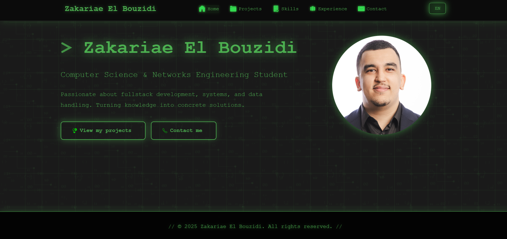

# Accessible sur PC et mobile

## About

Personal portfolio, compatible for both mobile/desktop, developed in HTML5, CSS3 and vanilla Javascript. bilingual french/english interface with smooth animations and modern dark theme.



**Screenshot of portfolio**

## Technologies used

- frontend : html5, css3, javascript (es6+)
- design : matrix theme with green colors and animations
- responsive : mobile-first design
- performance : optimized animations, fast loading

## Features

- bilingual interface : french/english with toggle
- responsive design : optimized mobile, tablet, desktop
- smooth animations : matrix effects, css transitions
- contact form : emailjs integration
- direct links : github, linkedin, apk/pdf downloads

## Sections

- home : presentation with animated profile photo
- projects : 4 projects with github links and demos
- skills : mastered technologies
- experience : chronological timeline
- contact : form and contact information

## Project structure

```
portfolio/
├── index.html #main page
├── styles.css #css styles with matrix theme
├── script.js #javascript for animations and interactions
├── Emoticone/ #custom icons
├── CVPHOTO.jpg #profile photo
└── README.md #documentation
```

## Live demo

url : https://zakbzd100.github.io/Portfolio

## Author

zakariae el bouzidi - full stack developer  
- email : zak.elbouzidi@gmail.com  
- linkedin : https://www.linkedin.com/in/zakariae-elbouzidi  
- github : https://github.com/ZakBZD100  

## License

this project is under mit license. free to use and modify.

---

 
